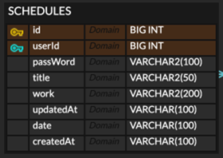

### 🐤  일정 관리 어플리케이션🐤
### 🐤 🐤 기능
 - 일정 생성
 - 일정 단건 조회
 - 일정 전체 조회
 - 일정 수정(할 일, 작성자 명)
 - 일정 삭제

### 🐤 🐤 🐤 ERD

(1) id : 각 데이터의 고유 식별자(PK)

(2) userId : 사용자 식별자

(3) passWord : 수정 삭제 시, 검증 값

(4) title : 제목

(5) work : 할 일

(6) updatedAt : 수정 날짜

(7) date : 일정 날짜

(8) createdAt : 생성 날짜

### 🐤 🐤 🐤 🐤 API 명세서 : https://www.notion.so/12f291f637868060b438d028034d0796?v=46f5d893b7034c2face1b0184734c781
    
### 🐤 🐤 🐤 🐤 🐤  개발 후기
    Spring을 사용한 첫 프로젝트였다.
    기본적인 CRUD와 테이블을 다루었고, CRUD의 핵심이 되는 MVC 패턴에서 기존에는 Controller에 많은 책임이 있음에 따라, 
    Controller, Service, Repository로 책임을 분리하여 구성하였다.

    데이터를 어떻게 넘겨 받고, 해당 데이터로 로직을 구현하고, 결과값을 반환하는 방법을 알게되는 시간이었다.
    꼭 하루에 몰아서 모두 개발하지 말고, 나눠서 진행하자!
